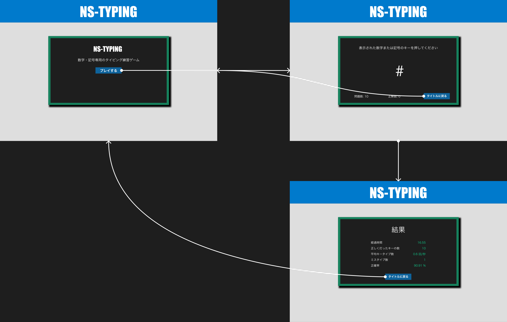

# NS-TYPING

数字・記号専用のタイピング練習ゲームです。

## 画面遷移図



[UIトレース](https://www.figma.com/proto/ilvpEFLPiIpurK50sKYBUJ/UI%E3%83%88%E3%83%AC%E3%83%BC%E3%82%B9?page-id=0%3A1&type=design&node-id=1-2&viewport=127%2C247%2C0.14&t=WNtpkY8cXm1EmoMP-1&scaling=scale-down&starting-point-node-id=1%3A2&mode=design)

[Figmaのプロトタイプのリンク](https://www.figma.com/proto/5m2lONFVvXU8gQbnKYqB7V/%E7%94%BB%E9%9D%A2%E9%81%B7%E7%A7%BB%E5%9B%B3?page-id=0%3A1&type=design&node-id=1-2&viewport=-846%2C126%2C0.37&t=k3MWdwYGd1GHFb1A-1&scaling=scale-down&starting-point-node-id=1%3A2&mode=design)

## 環境構築

### 1. Minikube を起動し、クラスターを作成
```
minikube start
```

### 2. kubectl のインストール（macOS）
```
brew install kubectl
```

### 3. Minikube の Docker デーモンでビルドするための設定
```
eval $(minikube docker-env)
```

### 4. Docker イメージを作成
```
docker build -t game:1 .
```

### 5. マニフェストファイル（yaml）から Deployment と Service を作成
```
kubectl apply -f deployment-service.yaml
```