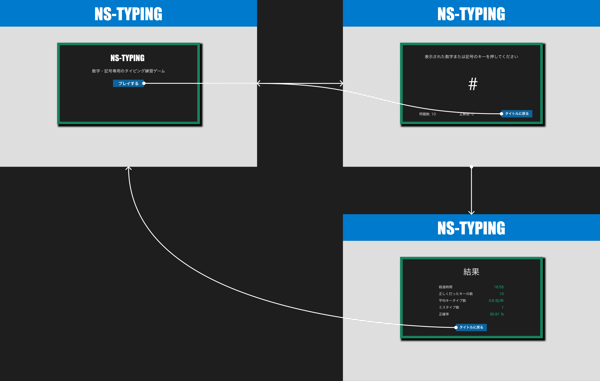

# NS-TYPING

数字・記号専用のタイピング練習ゲームです。

## 画面遷移図



[UI トレース](https://www.figma.com/proto/ilvpEFLPiIpurK50sKYBUJ/UI%E3%83%88%E3%83%AC%E3%83%BC%E3%82%B9?page-id=0%3A1&type=design&node-id=1-2&viewport=127%2C247%2C0.14&t=WNtpkY8cXm1EmoMP-1&scaling=scale-down&starting-point-node-id=1%3A2&mode=design)

[Figma のプロトタイプのリンク](https://www.figma.com/proto/5m2lONFVvXU8gQbnKYqB7V/%E7%94%BB%E9%9D%A2%E9%81%B7%E7%A7%BB%E5%9B%B3?page-id=0%3A1&type=design&node-id=1-2&viewport=-846%2C126%2C0.37&t=k3MWdwYGd1GHFb1A-1&scaling=scale-down&starting-point-node-id=1%3A2&mode=design)

## 環境構築

### Minikube, kubectl のインストール（macOS）

```
brew install minikube kubectl
```

### Minikube を起動し、クラスターを作成

```
minikube start --addons=ingress
```

### Minikube の Docker デーモンでビルドするための設定

```
eval $(minikube docker-env)
```

### Docker イメージを作成

```
docker build -t game:1 .
```

### マニフェストファイル（yaml）から Deployment, Service, Ingress を作成

```
kubectl apply -f k8s/
```

### Service の URL を取得

```
minikube service tetsu19n1101087-game-service --url
```
出力された URL にアクセスする。

### host名で名前解決できるよう設定
名前解決したいホスト名を、`/etc/hosts` に追記する。
```
127.0.0.1 tetsu19n1101087-game.local
```

Minikube とホストマシンをトンネリング（別タブで行う）。
```
minikube tunnel
```


host名でアプリにアクセスできることを確認
```
curl tetsu19n1101087-game.local
```
または、ブラウザでアクセスする。

## Skaffold による環境構築
Minikube を起動し、`eval $(minikube docker-env)` で Docker に接続するところまでは同じ。

### Skaffold のインストール（macOS）
```
brew install skaffold
```

### マニフェストファイル（skaffold.yaml）を作成
```
skaffold init
```
ビルダーを尋ねられたら Dockerfile を選択する。  
設定を `skaffold.yaml` に記述するか尋ねられるので yes を選択する。

### ビルド & デプロイ
```
skaffold dev
```
ソースコードに変更があった場合は、自動でビルド・デプロイを行なってくれる。  
同様に、host名でアプリにアクセスできることを確認する。

以下の環境構築も、全て行ってくれるため、`skaffold dev` を使う場合は、以下は不要
（MongoDB の **[レプリカセットの初期化](#レプリカセットの初期化)** のみ、skaffold を使う場合でも行う必要がある）
。

## API の構築

### API の起動
```
node api-server/app.js
```
API サーバーを起動し、別タブから React アプリを起動する。
```
yarn start
```

### minikube上でAPIを動かす
Minikube を起動し、`eval $(minikube docker-env)` で Docker に接続するところまでは同じ。

Docker イメージを作成。
```
docker build -t game-api:1 ./api-server/
```

マニフェストファイル（yaml）から Deployment, Service, Ingress を作成。
```
kubectl apply -f k8s/
```

名前解決したいホスト名を、`/etc/hosts` に追記する。
```
127.0.0.1 api.tetsu19n1101087-game.local
```

Minikube とホストマシンをトンネリング（別タブで行う）。
```
minikube tunnel
```

host名でAPIにアクセスできることを確認。
```
curl api.tetsu19n1101087-game.local/generate
```
または、ブラウザでアクセスする。

## PostgreSQL
API 構築の、`docker build -t game-api:1 ./api-server/` で Docker イメージを作成するところまでは同じ。

Kubegres operator をインストール。
```
kubectl apply -f https://raw.githubusercontent.com/reactive-tech/kubegres/v1.18/kubegres.yaml
```

マニフェストファイル（yaml）から PostgreSQL のクラスター, 認証情報の Secret, Ingress を作成。
```
kubectl apply -f k8s/
```

名前解決したいホスト名を、`/etc/hosts` に追記する。
```
127.0.0.1 api.tetsu19n1101087-game.local
```

Minikube とホストマシンをトンネリング（別タブで行う）。
```
minikube tunnel
```

host名でAPIにアクセスできることを確認。
```
curl api.tetsu19n1101087-game.local/results
```
または、ブラウザでアクセスする。

### データベース API 機能一覧
| 処理内容 | URL       | メソッド |
|----------|-----------|----------|
| 取得     | /results  | GET      |
| 保存     | /results  | POST     |

## MongoDB
API 構築の、`docker build -t game-api:1 ./api-server/` で Docker イメージを作成するところまでは同じ。

マニフェストファイル（yaml）から MongoDB の StatefulSet, Service を作成。
```
kubectl apply -f k8s/
```

### レプリカセットの初期化
実行中の MongoDB コンテナに入る。
```
kubectl exec -it mongodb-0 -c mongodb -- mongosh
```

```js
// "game"データベースに変更
use game

// レプリカセットの初期化
rs.initiate({
  _id: "rs0",
  members: [
    { _id: 0, host: "mongodb-0.mongodb-service.default.svc.cluster.local:27017", priority: 2 },
    { _id: 1, host: "mongodb-1.mongodb-service.default.svc.cluster.local:27017", priority: 1 },
    { _id: 2, host: "mongodb-2.mongodb-service.default.svc.cluster.local:27017", priority: 1 }
  ]
});

// ユーザーの作成（primary で行う）
db.createUser({ user: "app_user", pwd: "app_password", roles: [{ role: "readWrite", db: "game" }] });
```

その後の手順や、データベース API 機能は、PostgreSQL と同様。

## テスト
```
yarn test
yarn run cypress:run
```
Cypress のテストは、API・React アプリを起動した状態で行う。